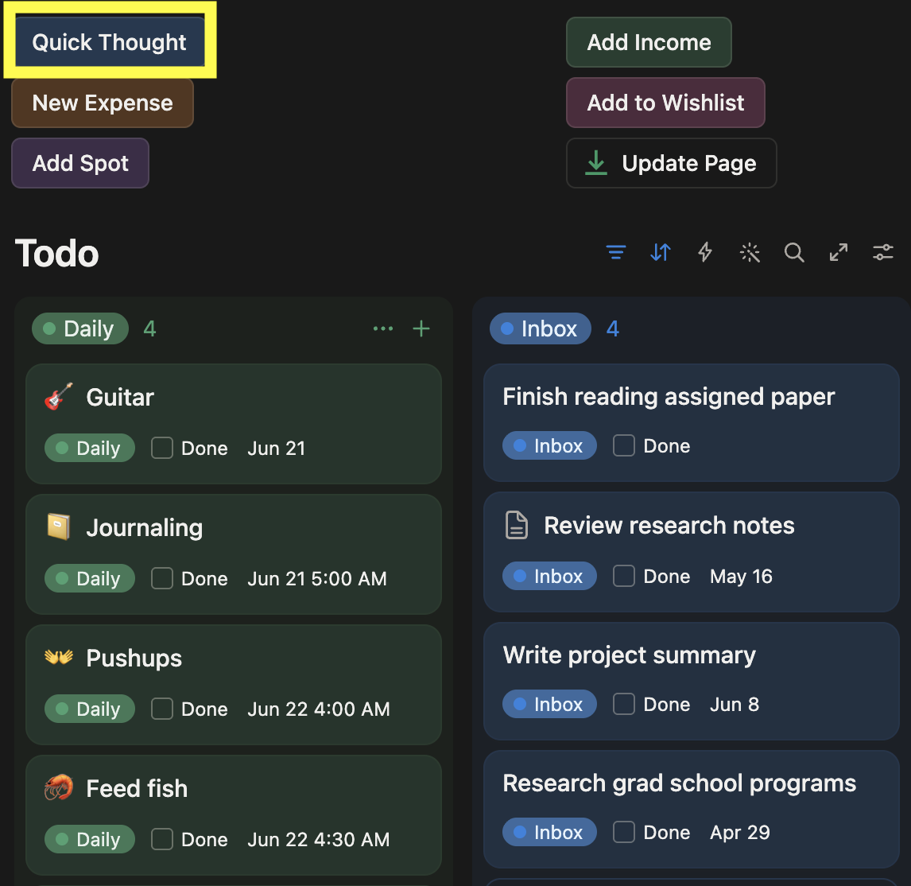
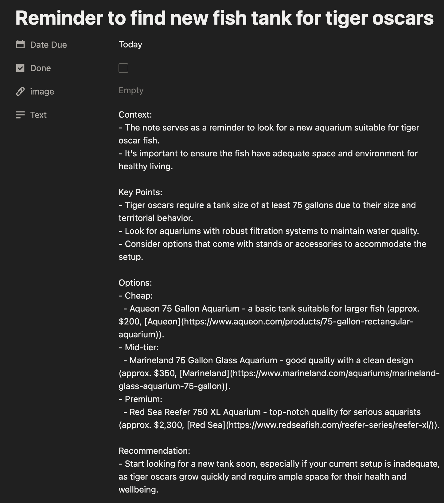
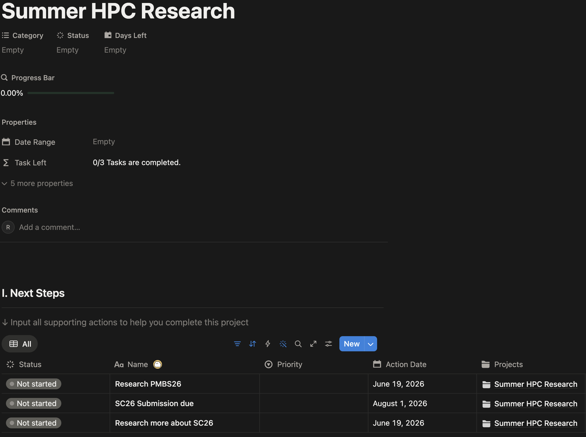
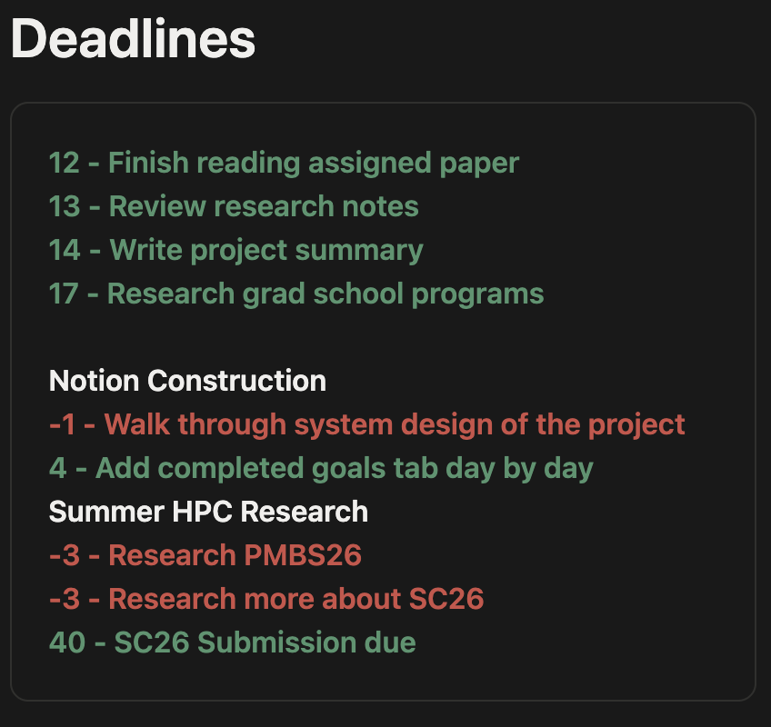

# Notion Webhook Server
A personal automation backend that reacts to changes in a Notion workspace, using AI to summarize new notes and keep task/calendar status blocks up to date, running continuously as a systemd service on a Raspberry Pi.


````mermaid
flowchart TB
    L[Scheduler] --> M[refresh.py]
    M --> F

    A[Notion Workspace] --> B[FastAPI: /notion-webhook]
    B --> C[Event Queue]
    C --> D[Background Worker]
    D --> E{Debounce: 20s passed?}
    D --> H{Page created?}
    E -->|Yes| F[Refresh deadline + important-things callouts]
    E -->|No| G[Drop event, do nothing]
    H -->|Yes| I[OpenAI: classify + summarize note]
    H -->|No| K[Not a new page, do nothing]
    I --> J[Write summary back to page]
````

## How it works (Updated 6/22/2026)

1. ### Add a new task to Todo database using the "Quick Thought" button



2. ### Notion will send a webhook to server and todo description will have an AI generated helpful note about the item through the OpenAI API.



3. ### Add your own projects and tasks in each project




4. ### The due dates for every Todo and Task items from projects will appear here



5. ### A dynamic callout based off the time of the day and how many tasks are due, events planned for today or tomorrow, as well as recommendations for planning sleep time.

