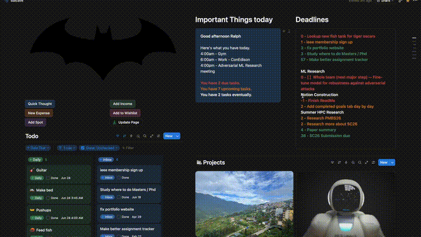
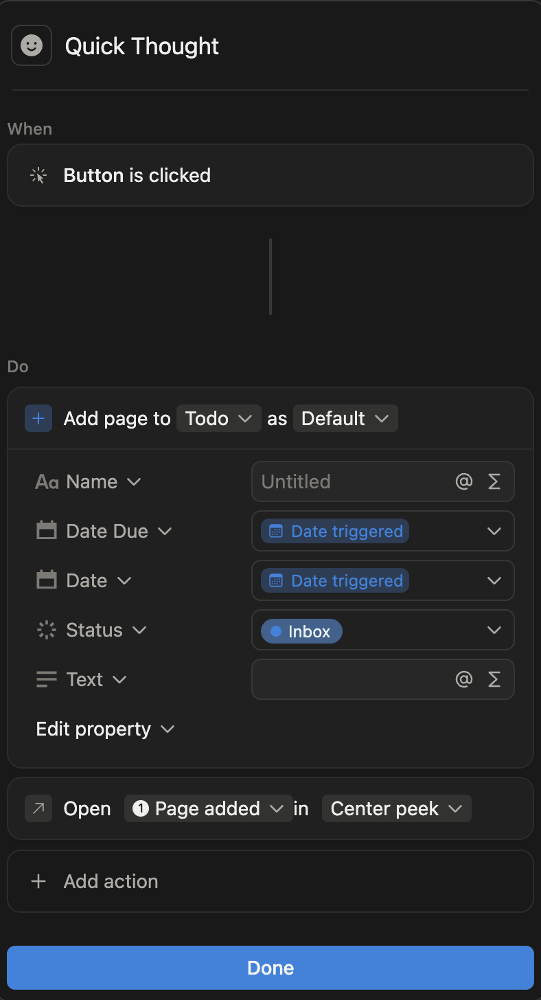
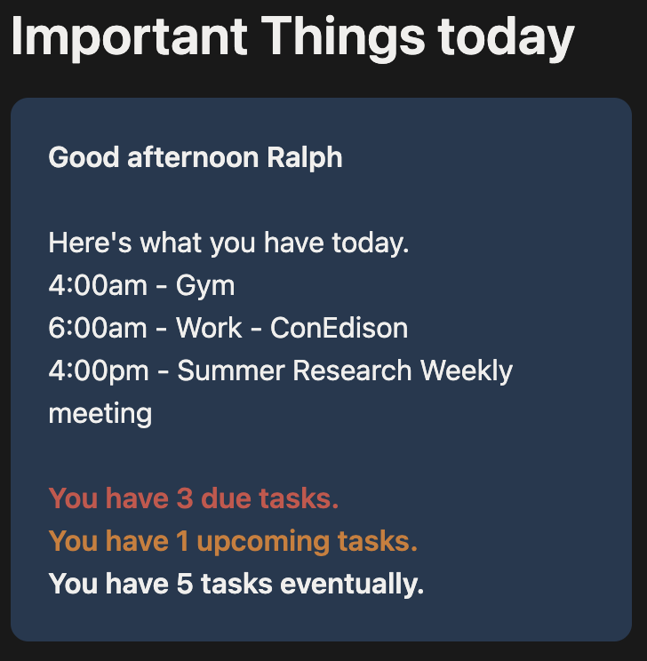
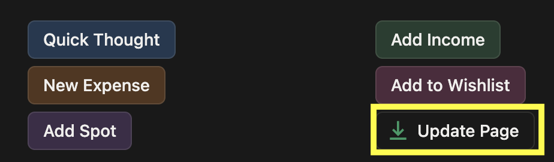
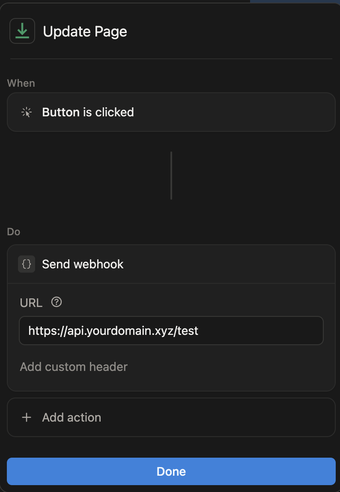

# Notion Webhook Server
**Stack:** Python · FastAPI · Notion API · OpenAI · Google Calendar · Cloudflare Tunnel · systemd

A personal automation backend that responds to changes in a Notion workspace, using AI to summarize new notes and keep task/calendar status blocks up to date, running continuously as a systemd service on a Raspberry Pi.

## Contents

- [Required Software & Hardware](#required-software--hardware)
- [Webhook Event Flow](#webhook-event-flow)
- [How to use it](#how-to-use-it-updated-6242026)
- [Getting Started](#getting-started)
- [Future updates](#future-updates)
- [Security](#security)


## Required Software & Hardware
Everything needed to stand up this project from scratch.

### Hardware
- Raspberry Pi — runs the server 24/7. Any model with networking works; a Pi 4 (2GB+) is comfortable. (Use ethernet for most reliable connection.)
- microSD card (16GB+) with Raspberry Pi OS, plus a reliable power supply.
- A separate machine with a browser (e.g. a Mac), since the Pi is headless use Raspberry Pi Connect or ssh into machine.

### Software / Runtime
- Raspberry Pi OS (Debian-based Linux).
- Python 3 with pip.
- systemd — keeps webhook-server.service alive and drives the hourly webhook-refresh.timer.
- cloudflared — Cloudflare Tunnel daemon exposing the Pi at api.yourdomain.xyz without opening ports.

### Accounts & Credentials
- Notion integration — internal integration token plus the database/block IDs the server reads and writes.
- OpenAI API key — for the GPT-4o-mini summarization and callout formatting.
- Google Cloud OAuth client (Desktop app type) — credentials.json, used to generate token.json with the calendar.readonly scope.
- A registered domain — you need to use your own. Register it with any registrar (or Cloudflare Registrar) and point its nameservers at Cloudflare.
- Cloudflare account — free tier is fine; hosts DNS for the domain and runs the named tunnel.

### Credential Files
- credentials.json — Google OAuth client secrets.
- token.json — authorized Google Calendar token

### Packages Necessary
- pip install -r requirements.txt

## Webhook Event Flow
````mermaid
flowchart TB
    L[Scheduler] --> M[refresh.py]
    M --> F

    A[Notion Workspace] --> B[FastAPI: /notion-webhook]
    B --> C[Event Queue]
    C --> D[Background Worker]
    D --> E{Debounce: 20s passed?}
    D --> H{Page created?}
    E -->|Yes| F[Refresh deadline + important-things callouts]
    E -->|No| G[Drop event, do nothing]
    H -->|Yes| I[OpenAI: classify + summarize note]
    H -->|No| K[Not a new page, do nothing]
    I --> J[Write summary back to page]
````

## Getting Started

### Step 1 — Prerequisites
Before you begin, please ensure you have the [required hardware & software](#required-software--hardware)

### Step 2 — Clone the repo & create a virtual environment

SSH into the Pi (or Raspberry Pi Connect), then:

```bash
git clone git@github.com:23alcor/Notion-Webhook-server.git ~/Documents/webhook-server
cd webhook-server

python3 -m venv .venv
source .venv/bin/activate
```

Your prompt should now start with `(.venv)`, meaning the virtual environment is active.

### Step 3 — Install dependencies

With the virtual environment active:

```bash
pip install -r requirements.txt
```

This installs FastAPI, Uvicorn, and the Notion/OpenAI/Google client libraries into the `.venv`.

### Step 4 — Configure environment variables

The app reads its configuration from a `.env` file in the project root. Create one:

```bash
nano .env
```

Add the following, filling in your own values:

```env
# Notion
NOTION_TOKEN=secret_xxxxxxxxxxxxxxxxxxxxx
NOTION_DATABASE_ID=...
NOTION_HOME_PAGE_ID=...
NOTION_TODO_ID=...
NOTION_TASKS_ID=...
NOTION_DEADLINE_BLOCK_ID=...
NOTION_IMPORTANT_THINGS_BLOCK_ID=...

# OpenAI
OPENAI_API_KEY=sk-xxxxxxxxxxxxxxxxxxxxx
```

**Never commit this file** — it holds live secrets. Make sure `.env` is listed in `.gitignore`.

#### Choosing an AI provider (paid vs. free)

This project uses OpenAI's `gpt-4o-mini` by default, which requires a paid
API account (prepaid credits, $5 minimum). Usage is tiny — a few summaries a
day costs cents — but it is not free.

**Free alternative:** the AI summarization can run on a free-tier provider
instead. [Google Gemini](https://ai.google.dev/) offers ~1,500 requests/day
on Gemini Flash with no credit card, which is more than enough for personal
use (and you may already have a Google account from the Calendar setup).
[Groq](https://console.groq.com/) is another no-card free option running
open models like Llama.

> **Note:** switching providers currently requires a small code change in
> `ai/openai_client.py`. Gemini and Groq both expose OpenAI-compatible
> endpoints, so this can often be done by pointing the client's `base_url`
> and API key at the alternative provider. A provider-agnostic config switch
> is on the roadmap (see [Future updates](#future-updates)).

### Step 5 — Authorize Google Calendar (one-time)

The server reads your calendar with the `calendar.readonly` scope, which
requires a one-time OAuth approval. Because the Pi is headless (no browser),
run the authorization on a machine that has one (e.g. your Mac).

1. Copy your `credentials.json` (the OAuth client downloaded from Google
   Cloud) to that machine.
2. Run the local authorization script:

```bash
python authorize_google_local.py
```

   This opens your browser, asks you to sign in and approve access, then
   writes a `token.json` file.
3. Copy `token.json` to the Pi's project root:

```bash
scp token.json pi-ssh:~/Documents/webhook-server/token.json
```

The server now authenticates to Google using `token.json` and refreshes it
automatically when it expires.

### Step 6 — Run it locally and test

With your `.env` filled in and `token.json` in place, start the server:

```bash
uvicorn app:app --host 0.0.0.0 --port 8000
```

- `app:app` means "in `app.py`, use the `app` object."
- `--host 0.0.0.0` makes it listen on all network interfaces (so the
  Cloudflare tunnel can reach it), not just localhost.
- `--port 8000` is the port the app serves on.

In another terminal, confirm it's alive:

```bash
curl http://localhost:8000/health
# {"status":"ok"}
```

If you get `{"status":"ok"}`, the server is running correctly.

### Step 7 — Expose it with Cloudflare Tunnel

The Pi has no public IP, so a Cloudflare Tunnel exposes it at your domain
without opening any router ports. This project uses a named tunnel whose
config lives on the Pi.

1. Authenticate cloudflared (one-time, opens a browser to pick your domain):

```bash
cloudflared tunnel login
```

2. Create a named tunnel (note the tunnel ID it prints):

```bash
cloudflared tunnel create webhook-server
```

3. Route your hostnames to the tunnel:

```bash
cloudflared tunnel route dns webhook-server api.yourdomain.xyz
cloudflared tunnel route dns webhook-server ssh.yourdomain.xyz
```

4. Configure the tunnel in `~/.cloudflared/config.yml`:

```yaml
tunnel: <your-tunnel-id>
credentials-file: /home/<user>/.cloudflared/<your-tunnel-id>.json

ingress:
  # Web app — the FastAPI server
  - hostname: api.yourdomain.xyz
    service: http://localhost:8000

  # SSH access to the Pi (no port 22 open to the internet)
  - hostname: ssh.yourdomain.xyz
    service: ssh://localhost:22

  # Required catch-all
  - service: http_status:404
```

5. Run it (kept alive by systemd — see Step 8):

```bash
cloudflared tunnel run
```

Your server is now reachable at `https://api.yourdomain.xyz`, and the Pi is
reachable over SSH via `ssh.yourdomain.xyz`.

### Step 8 — Keep it running with systemd

So the server, tunnel, and hourly refresh survive reboots and crashes, run
them as systemd services.

**a) The web server** — `/etc/systemd/system/webhook-server.service`

```ini
[Unit]
Description=Notion Webhook Server (FastAPI)
After=network.target

[Service]
User=<user>
WorkingDirectory=/home/<user>/Documents/webhook-server
ExecStart=/home/<user>/Documents/webhook-server/.venv/bin/uvicorn app:app --host 0.0.0.0 --port 8000
Restart=always

[Install]
WantedBy=multi-user.target
```

**b) The Cloudflare tunnel** — installed as a service by cloudflared:

```bash
sudo cloudflared service install
```

**c) The hourly refresh** — a oneshot service driven by a timer.

`/etc/systemd/system/webhook-refresh.service`
```ini
[Unit]
Description=Refresh Notion blocks

[Service]
Type=oneshot
User=<user>
WorkingDirectory=/home/<user>/Documents/webhook-server
ExecStart=/home/<user>/Documents/webhook-server/.venv/bin/python refresh.py
```

`/etc/systemd/system/webhook-refresh.timer`
```ini
[Unit]
Description=Refresh Notion blocks every hour

[Timer]
OnBootSec=1min
OnUnitActiveSec=1h

[Install]
WantedBy=timers.target
```

**Enable everything:**

```bash
sudo systemctl daemon-reload
sudo systemctl enable --now webhook-server.service
sudo systemctl enable --now webhook-refresh.timer
```

**Check status anytime:**

```bash
systemctl status webhook-server
systemctl status webhook-refresh.timer
```

### Step 9 — Register the webhook in Notion

Finally, tell Notion to send events to your server.

1. Go to your integration settings at
   [notion.so/my-integrations](https://www.notion.so/my-integrations) and
   open the integration you created in Step 1.
2. Under the **Webhooks** tab, add a subscription pointing to your endpoint:
```
https://api.yourdomain.xyz/notion-webhook
```

3. Notion sends a one-time **verification request** with a `challenge` value.
   Your server already handles this — it echoes the challenge back so Notion
   can confirm the URL is yours. Watch the logs to see it arrive:

```bash
journalctl -u webhook-server -f
```

4. Once verified, subscribe to the event types the server handles (e.g.
   `page.created` and database/page content updates) and save.
5. Make sure the integration is shared with the databases it needs to read
   (Todo, Tasks) and the page holding the callout blocks.

Now create a task in Notion using the "Quick Thought" button — within a few
seconds the server should process the event and update the page.


## How to use it (Updated 6/24/2026)


*Video sped up 2x*

1. **Add a new task to Todo database using the "Quick Thought" button.**




2. **Notion will send a webhook to server. The server will generate a helpful note about the item through the OpenAI API and insert into the todo description for the todo item.**


3. **Add your own projects and tasks in each project.**


4. **The due dates for every item in the Todo database and Task item from projects will appear here.**


5. **A dynamic callout based off the time of the day and how many tasks are due, events planned for today or tomorrow, as well as recommendations for planning sleep time.**



6. **You can click "Update Page" to refresh both "Important Things today" and "Deadlines"**




## Future updates

- Budget tracker in the important things today callout
- Planning todos suggestments for tomorrow
- Add testing webhooks
- Switch AI provider

## Security

- **Secrets stay out of git.** `.env`, `credentials.json`, and `token.json` are gitignored; config is loaded at runtime, never hardcoded.
- **No open inbound ports.** The Pi is reachable only through the Cloudflare Tunnel (web + SSH), so nothing is exposed directly to the internet.
- **Least-privilege Google access.** Calendar uses the read-only `calendar.readonly` scope.
- **Planned hardening:** verify Notion's webhook signature (HMAC) on `/notion-webhook`, and set an OpenAI spend cap as a billing backstop.